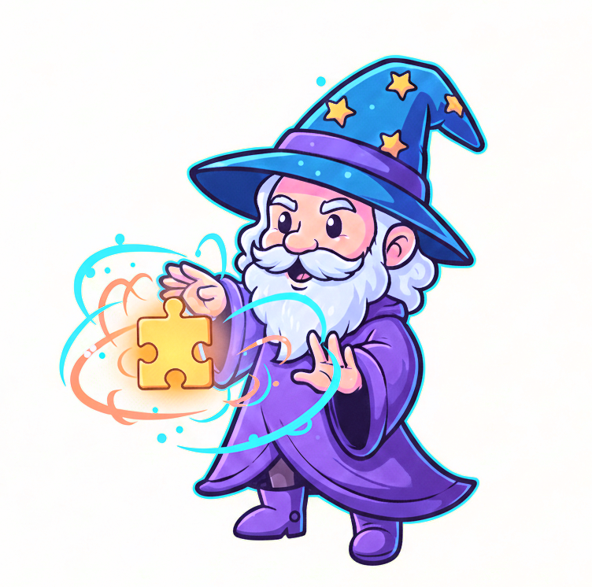

# summon-missing-puzzle-piece

@jamerh and gemini



Don't you hate it when a puzzle is missing a piece? 

Try out this OpenCV script that uses a photo of a nearly-complete puzzle missing a piece and a scan of the puzzle box / poster to generate a dimenionally accurate replacement puzzle piece and svg outline (for laser cutting. 

Heavily vibe coded in a single 3 hour session, may not function as intended. 


This tool can be used as a library, a command-line utility, or integrated into a cross-platform GUI.

## Examples

- Original Complete Image: [`complete.jpg`](images/example1/complete.jpg)
- Original Missing Image: [`missing.jpg`](images/example1/missing.jpg)

- Intermediate Feature Matching Visualization: [`replacement_matching.png`](images/example1/replacement_matching.png)

- Intermediate Layers (TIFF): [`replacement_layers.tiff`](images/example1/replacement_layers.tiff)
- Final Replacement Image: [`replacement.png`](images/example1/replacement.png)
- SVG Contour for laser cutting: [`replacement_contour.svg`](images/example1/replacement_contour.svg)

## Installation

### Conda
It is recommended to use a conda environment for managing dependencies:

```bash
# Create a new conda environment
conda create -n image_aligner python=3.9

# Activate the environment
conda activate image_aligner

# Install necessary packages
conda install -c conda-forge opencv-python pillow matplotlib svgwrite
```

### Pip
Alternatively, you can install the dependencies using pip, preferably within a virtual environment:

```bash
# (Optional) Create and activate a Python virtual environment
python -m venv venv_image_aligner
source venv_image_aligner/bin/activate # On Windows use `venv_image_aligner\\Scripts\\activate`

# Install necessary packages
pip install opencv-python Pillow matplotlib svgwrite
```

## Usage

### Command Line Interface (CLI)
To use the script from the command line, run `your_script_name.py` with the required image paths and optional flags:

```bash
python your_script_name.py complete.jpg missing.jpg replacement.png \
    --save_intermediate \
    --show_matches \
    --draw_contours \
    --save_svg_contour \
    --debug
```

- `complete.jpg`: Path to the complete image (reference image).
- `missing.jpg`: Path to the image with the region to be aligned and processed.
- `replacement.png`: Path to save the final output image.
- `--save_intermediate`: Save intermediate aligned images as a multi-layer TIFF.
- `--show_matches`: Display feature matching visualization.
- `--draw_contours`: Draw a red 1px outline around the replaced region in the final output.
- `--save_svg_contour`: Save the aligned contour of the white region as an SVG file.
- `--debug`: Enable debug prints for diagnostic information.

### As a Python Library
To integrate the `ImageAligner` class into your Python project:

```python
import cv2
from your_script_name import ImageAligner # Assuming your class is in your_script_name.py

# Initialize the aligner (debug=True for verbose output)
aligner = ImageAligner(debug=True)

# Define image paths
complete_image_path = 'complete.jpg'
missing_image_path = 'missing.jpg'
output_path = 'replacement_from_library.png'

# Process the images
complete_img, missing_img_aligned, final_output_img = aligner.process(
    complete_image_path,
    missing_image_path,
    output_path,
    save_intermediate=True,       # Save intermediate layers
    show_matches=False,           # Show matches (if matplotlib is configured)
    draw_contours=True,           # Draw contours on final output
    save_svg_contour=True         # Save SVG contour
)

# You can also work with the returned numpy arrays (complete_img, missing_img_aligned, final_output_img)
# For example, to display the final output:
# import matplotlib.pyplot as plt
# plt.imshow(cv2.cvtColor(final_output_img, cv2.COLOR_BGRA2RGBA))
# plt.title("Final Output from Library")
# plt.axis('off')
# plt.show()
```

# Logical flow

# Image Aligner Script

This Python script is designed to align two images, where one image serves as a reference with correct dimensions and orientation, and the second image needs to be resized and rotated to align with a specific subsection of the first. The second image will contain damaged pixels, puzzlelines, and different color balances, as well as a distinct white area of one missing piece.

The script's core capabilities include:
- **White Region Isolation**: Utilizes the watershed or similar algorithms (specifically `_find_white_region`) to detect and outline a prominent white area in the second image. All pixels within this outline are then converted to a clear alpha channel, making them transparent.
- **Dark Line Handling**: Identifies and masks out continuous dark lines using `_find_dark_lines_mask` to prevent them from interfering with feature detection.
- **Feature Detection and Matching**: Employs robust feature detection algorithms (like SIFT) and matching (BFMatcher with ratio test) to identify corresponding points between the non-transparent, non-dark-line areas of the second image and the first image.
- **Affine Transformation**: Calculates an affine transformation (resizing and rotation) based on the matched features to accurately align the second image with the first.
- **Output Generation**: Creates a final output image by taking pixels from the first image that overlap with the now transparently outlined region of the aligned second image. A sharp, dark outline is optionally generated around this region. The output is saved as a PNG, preserving original DPI for correct print scaling.
- **Intermediate Output**: Provides an option to save intermediate aligned images in a multi-layered TIFF format for debugging and analysis.
- **SVG Contour Export**: Allows exporting the aligned outline of the white region as an SVG file.

