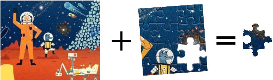
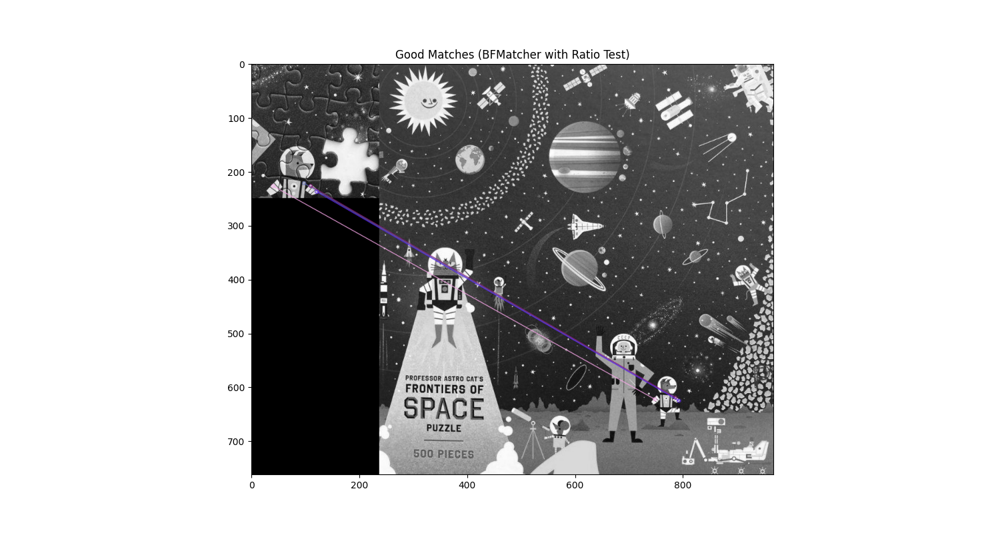
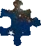

# summon-missing-puzzle-piece <a href="https://github.com/JamesRH/summon-missing-puzzle-piece"> </a>


<!-- badges: start -->


 
🤖 Vibe Coded!
<!-- badges: end -->


**Don't you hate it when a puzzle is missing a piece?**

Try out this OpenCV script that uses a photo of a nearly-complete puzzle missing a piece + a scan of the puzzle box / poster to generate a dimenionally accurate replacement puzzle piece image and svg outline (for laser cutting). 

Heavily vibe coded in a single 3 hour session, may not function as intended. 

by @jamerh and gemini



This tool can be used as a library, a command-line utility, or integrated into a cross-platform GUI.

## Example

### Input:

- Complete puzzle image from box or poster, scanned to be high resolution: 
 

- You must pass in the puzzle size (in inches) for the output piece to be dimensionally acurate (if not provided, the dimensions of the complete image are used)

- Photo of missing piece space with white background: 
 


### Output:

-  Intermediate feature matching visualization (optional):
 

- Final Replacement Image:
 

Other output files include:
- SVG Contour for laser cutting: [`replacement_contour.svg`](images/example1/replacement_contour.svg)
- Intermediate Layers (TIFF): [`replacement_layers.tiff`](images/example1/replacement_layers.tiff)

## Installation

### Conda
It is recommended to use a conda environment for managing dependencies:

```bash
# Create a new conda environment (optionally use mamba)
conda create -n image_aligner -y -c conda-forge python=3.9 opencv-python pillow matplotlib svgwrite 

# Activate the environment
conda activate image_aligner
```

### Pip
Alternatively, you can install the dependencies using pip, preferably within a virtual environment:

```bash
# (Optional) Create and activate a Python virtual environment
python -m venv venv_image_aligner
source venv_image_aligner/bin/activate # On Windows use `venv_image_aligner\\Scripts\\activate`

# Install necessary packages
pip install opencv-python Pillow matplotlib svgwrite
```

## Usage

### Command Line Interface (CLI)
To use the script from the command line, run `your_script_name.py` with the required image paths and optional flags:

```bash
python summon_missing_puzzle_piece.py complete.jpg missing.jpg replacement.png
```

- `complete.jpg`: Path to the complete image (reference image, this sizing will be used).
- `missing.jpg`: Path to the image with the region to be aligned and processed.
- `replacement.png`: Path to save the final output image.

other CLI options:

```

```
### Batch CLI usage

### Batch Processing Mode

When the `--batchdir` argument is provided, the script switches to batch processing mode. In this mode, instead of processing single image files specified directly, it iterates through every subdirectory found within the `--batchdir`.

For each subdirectory, the script expects to find image files with specific names. By default, these names are `complete.jpg` for the complete image, `missing.jpg` for the image with the region to be aligned, and `replacement.png` for the output. You can override these default filenames using `--complete_filename`, `--missing_filename`, and `--output_filename` respectively.

All generated output files (the main PNG, intermediate TIFF, and SVG contour if enabled) will be saved directly into the same subdirectory where their corresponding input images were found.

**Expected Subdirectory Structure (example):**

```
batch_directory/
├── case_001/
│   ├── complete.jpg
│   ├── missing.jpg
│   └── replacement.png (output will be saved here)
├── case_002/
│   ├── complete.jpg
│   ├── missing.jpg
│   └── replacement.png (output will be saved here)
└── another_case/
    ├── complete.jpg
    ├── missing.jpg
    └── replacement.png (output will be saved here)
```

**Example CLI Usage for Batch Mode:**

```bash
python summon_missing_puzzle_piece.py --batchdir batch_directory/ \
    --save_intermediate \
    --save_svg_contour
```

### Other CLI options

```
    usage: summon_missing_puzzle_piece.py [-h] [--batchdir BATCHDIR]
                                          [--complete_filename COMPLETE_FILENAME]
                                          [--missing_filename MISSING_FILENAME]
                                          [--output_filename OUTPUT_FILENAME]
                                          [--save_intermediate] [--show_matches]
                                          [--draw_contours] [--save_svg_contour]
                                          [--debug]
                                          [--print_width_inches PRINT_WIDTH_INCHES]
                                          [--print_height_inches PRINT_HEIGHT_INCHES]
                                          [complete_image_path]
                                          [missing_image_path] [output_path]

    Align two images, replacing a white region in the second with a part of the
    first.

    positional arguments:
      complete_image_path   Path to the complete image (Image 1). Required unless
                            --batchdir is used.
      missing_image_path    Path to the missing image (Image 2). Required unless
                            --batchdir is used.
      output_path           Path to save the final output image (e.g.,
                            replacement.png). Required unless --batchdir is used.

    optional arguments:
      -h, --help            show this help message and exit
      --batchdir BATCHDIR   Optional: Directory containing subdirectories to
                            process in batch mode.
      --complete_filename COMPLETE_FILENAME
                            Default filename for the complete image within each
                            batch subdirectory. Used with --batchdir.
      --missing_filename MISSING_FILENAME
                            Default filename for the missing image within each
                            batch subdirectory. Used with --batchdir.
      --output_filename OUTPUT_FILENAME
                            Default filename for the output image within each
                            batch subdirectory. Used with --batchdir.
      --save_intermediate   Save intermediate aligned images in a multi-layer TIFF
                            format.
      --show_matches        Display feature matching visualization using
                            matplotlib.
      --draw_contours       Draw a red 1px outline around the replaced region in
                            the final output.
      --save_svg_contour    Save the aligned contour of the white region as an SVG
                            file.
      --debug               Enable debug prints for diagnostic information.
      --print_width_inches PRINT_WIDTH_INCHES
                            Desired physical print width of the output image in
                            inches. DPI will be calculated to match this width,
                            preserving aspect ratio.
      --print_height_inches PRINT_HEIGHT_INCHES
                            Desired physical print height of the output image in
                            inches. DPI will be calculated to match this height,
                            preserving aspect ratio.


```

### Use as a Python Library
To integrate the `ImageAligner` class into your Python project:

```python
import cv2
from your_script_name import ImageAligner # Assuming your class is in your_script_name.py

# Initialize the aligner (debug=True for verbose output)
aligner = ImageAligner(debug=True)

# Define image paths
complete_image_path = 'complete.jpg'
missing_image_path = 'missing.jpg'
output_path = 'replacement_from_library.png'

# Process the images
complete_img, missing_img_aligned, final_output_img = aligner.process(
    complete_image_path,
    missing_image_path,
    output_path,
    save_intermediate=True,       # Save intermediate layers
    show_matches=False,           # Show matches (if matplotlib is configured)
    draw_contours=True,           # Draw contours on final output
    save_svg_contour=True         # Save SVG contour
)

# You can also work with the returned numpy arrays (complete_img, missing_img_aligned, final_output_img)
# For example, to display the final output:
# import matplotlib.pyplot as plt
# plt.imshow(cv2.cvtColor(final_output_img, cv2.COLOR_BGRA2RGBA))
# plt.title("Final Output from Library")
# plt.axis('off')
# plt.show()
```

# Logical flow

# Image Aligner Script

This Python script is designed to align two images, where one image serves as a reference with correct dimensions and orientation, and the second image needs to be resized and rotated to align with a specific subsection of the first. The second image will contain damaged pixels, puzzlelines, and different color balances, as well as a distinct white area of one missing piece.

The script's core capabilities include:
- **White Region Isolation**: Utilizes the watershed or similar algorithms (specifically `_find_white_region`) to detect and outline a prominent white area in the second image. All pixels within this outline are then converted to a clear alpha channel, making them transparent.
- **Dark Line Handling**: Identifies and masks out continuous dark lines using `_find_dark_lines_mask` to prevent them from interfering with feature detection.
- **Feature Detection and Matching**: Employs robust feature detection algorithms (like SIFT) and matching (BFMatcher with ratio test) to identify corresponding points between the non-transparent, non-dark-line areas of the second image and the first image.
- **Affine Transformation**: Calculates an affine transformation (resizing and rotation) based on the matched features to accurately align the second image with the first.
- **Output Generation**: Creates a final output image by taking pixels from the first image that overlap with the now transparently outlined region of the aligned second image. A sharp, dark outline is optionally generated around this region. The output is saved as a PNG, preserving original DPI for correct print scaling.
- **Intermediate Output**: Provides an option to save intermediate aligned images in a multi-layered TIFF format for debugging and analysis.
- **SVG Contour Export**: Allows exporting the aligned outline of the white region as an SVG file.

